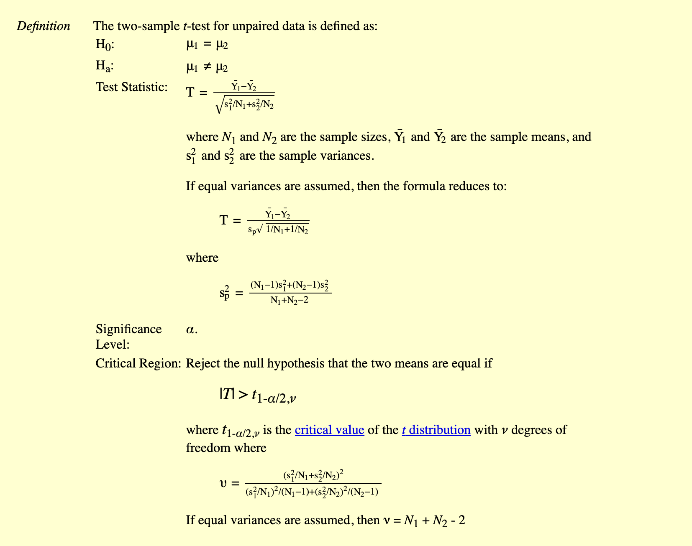

```{r setup, include=FALSE}
knitr::opts_chunk$set(echo = TRUE)
```

## Table 3

H0: p1 = p2 Ha: p1 != p2



```{r}
two_tail_t_binom <- function(s1,n1,s2,n2){
  mu_1 <- s1/n1
  mu_2 <- s2/n2
  df <- n1+ n2 -2
  s1 <- sqrt(mu_1*(1-mu_1)/(n1-1))
  s2 <- sqrt(mu_2*(1-mu_2)/(n2-1))
  sp <- sqrt(((n1-1)*s1^2 +(n2-1)*s2^2)/(n1+n2-2))
  t <- (mu_1 - mu_2)/(sp*sqrt(1/n1+1/n2))
  p_value <- 2*pt(q=abs(t), df=df, lower.tail=FALSE) # for a two-tail test
  paste('T-statistics is', round(t,3), 'and p_value is', round(p_value,3)) # for the fact we only need two decimal points
}
```

**For Assumption 1 vs Reminder:**

s1 = 27, n1 = 37

s2 = 20, n2 = 30

```{r}
two_tail_t_binom(s1=27, n1=37, s2=20,n2=30)
```

**For Assumption 2 vs Reminder:**

s1 = 22, n1 = 33

s2 = 20, n2 = 30

```{r}
two_tail_t_binom(s1=22, n1=33, s2=20,n2=30)
```

**For Assumption 3 vs Reminder:**

s1 = 24, n1 = 37

s2 = 20, n2 = 30

```{r}
two_tail_t_binom(s1=24, n1=37, s2=20,n2=30)
```

Overall vs Reminder:

s1 = 73, n1 = 107

s2 = 20, n2 = 30

```{r}
two_tail_t_binom(s1=73, n1=107, s2=20,n2=30)
```
